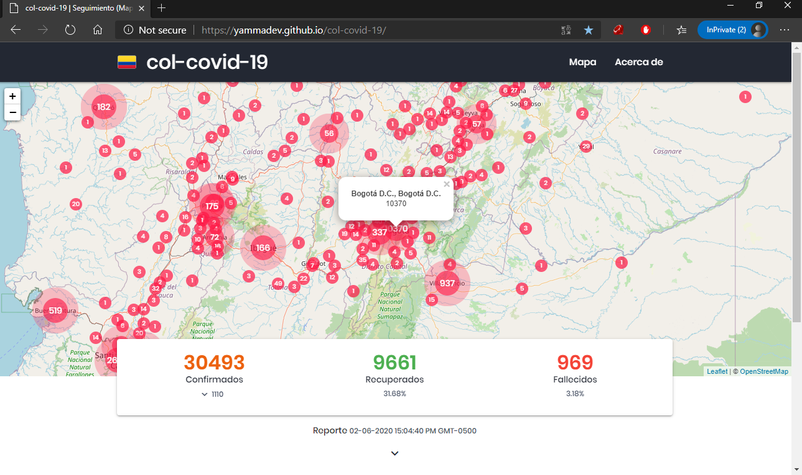
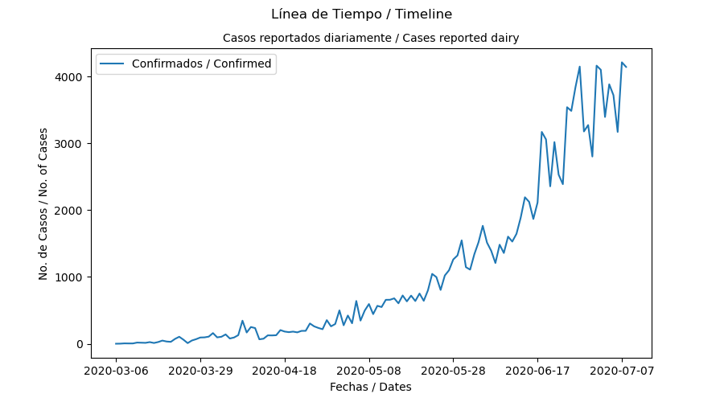
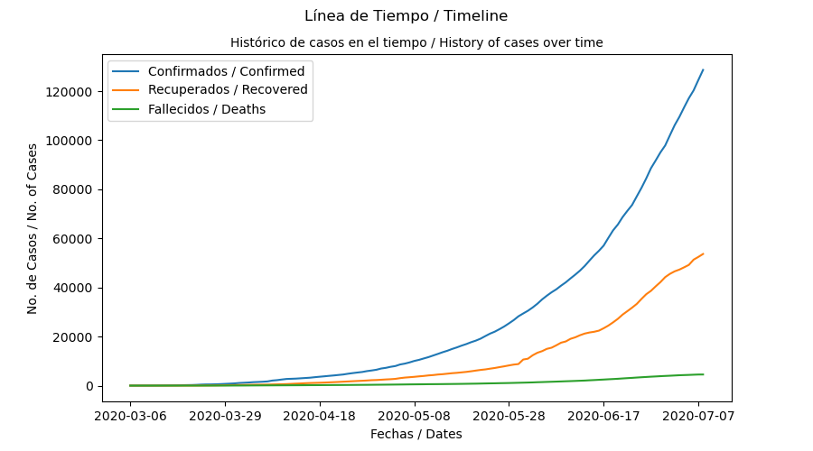
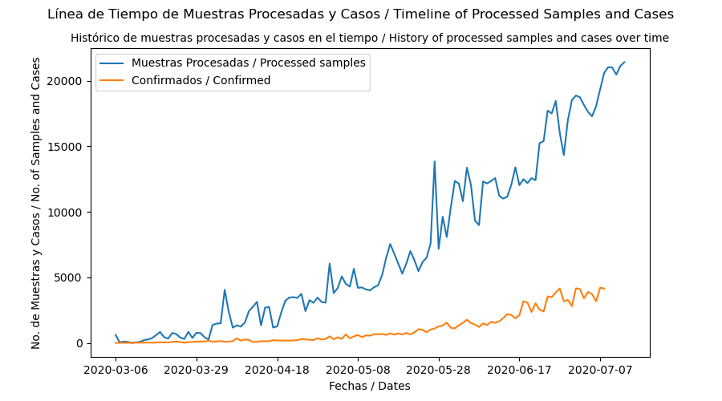

## 1. Acerca
#### Seguimiento (Mapa y Estadísticas) del *COVID-19* en *Colombia*
Este proyecto muestra el estado (mapas y estadísticas) casi en tiempo real basado en datos del [Ministerio de salud y protección social](https://www.minsalud.gov.co/Paginas/default.aspx) de Colombia, diseñado para brindar información sobre la evolución del [COVID-19](https://es.wikipedia.org/wiki/COVID-19) en el país y sus ciudades.

### Actualizaciones
- **Twitter** [@ColCovid19](https://twitter.com/ColCovid19)
- **Github** [col-covid-19](https://github.com/yammadev/col-covid-19.git)

### Autor
Yefferson Marí­n - ([@yammadev](https://github.com/yammadev))

### Licencia
[GNU General Public License v3.0](LICENSE)

## 2. Análisis
Se ha realizado un estudio independiente con los datos registrados. Refierase a éste repositorio [col-covid-19-analysis](https://github.com/yammadev/col-covid-19-analysis.git) para más información.

## 3. Datos
Los datos utilizados son cargados (una vez se realiza una actualización) desde los [Datos Abiertos](https://www.datos.gov.co/) del Gobierno Nacional, sobre los [Casos confirmados](https://www.datos.gov.co/Salud-y-Protecci-n-Social/Casos-positivos-de-COVID-19-en-Colombia/gt2j-8ykr) y las [Muestras procesadas](https://www.datos.gov.co/Salud-y-Protecci-n-Social/Muestras-procesadas-de-COVID-19-en-Colombia/8835-5baf), publicados por el [Ministerio de salud y Protección social](https://www.minsalud.gov.co/Paginas/default.aspx) de Colombia.

Los datos formateados se encuentran disponibles en la carpeta [data/](data) para su estudio y uso en formatos `.csv` y `.json`.

| Archivo | Referencia |
| :-----: | ---------- |
| `records` | Lista completa de CASOS con todos sus REGISTROS
| `statistics` | Casos por CIUDADES y DEPARTAMENTOS con COORDENADAS |
| `timeline` | CASOS por FECHAS y ESTADOS |
| `summary` | Resúmen de CASOS por ESTADO |
| `samples` | Lista completa de MUESTRAS procesadas |
| `cases_per_gender` | CASOS por GÉNERO |
| `cases_per_status` | CASOS por FECHAS y ESTADOS |
| `cases_per_kind` | CASOS por TIPO |
| `cases_per_level` | CASOS por NIVEL |
| `cases_per_origin` | CASOS por ORIGEN |

Adicionalmente, las gráficas de las estadísticas en formatos `.img` también están disponibles. Para mayor información sobre cómo usar los datos, consulte [data/generate.py](data/generate.py).

| Archivo | Referencia |
| :-----: | ---------- |
| `cases` | CASOS reportados diariamente |
| `timeline` | Histórico de CASOS en el tiempo |
| `samples` | Histórico de muestras procesadas y casos en el tiempo |







## 4. Notas de desarrollo
### Herramientas y Requerimientos
- [Python](https://www.python.org/)
- [PIP](https://pypi.org/project/pip/)
- [NPM](https://www.npmjs.com/)

### Construir
```sh
  # Install dependencies
  npm install

  # Build and export files
  npm run build

  # After asking to check generated files, it will be pushed automatically.
  # Otherwise it should be rebuilt and pushed manually.

  # Rebuild
  npm run rebuild
```

### Manualmente
```bash
  cd data

  # Virtual environment
  py -m venv venv

  # Activate
  venv\scripts\activate

  # Install requirements
  (venv) pip install -r requirements.txt

  # Generate data
  (venv) py generate.py

  # Deactivate
  (venv) venv\scripts\deactivate

  cd ..

  # Build and export files
  npm run build

  # Or watch for changes and rebuild
  npm run watch
```

## 5. Registro de Cambios
Todos los cambios notables a este proyecto están documentados en esta parte del archivo. El formato está basado en [Keep a Changelog](http://keepachangelog.com/).

#### [x.y.z] - AAAA-MM-DD
- **x** para versiones principales relacionadas con adiciones o cambios importantes.
- **y** para versiones menores relacionadas con adiciones o cambios menores en la versión principal actual.
- **z** para versiones menores relacionadas con adiciones o cambios menores en la versión menor actual.

#### Extras
- **Agregado** para nuevas funciones.
- **Modificado** por cambios en la funcionalidad existente.
- **Obsoleto** para funciones que se eliminarán próximamente.
- **Removido** para funciones eliminadas.
- **Corregido** cualquier corrección de errores.
- **Seguridad** en caso de vulnerabilidades.

### [2.10.0] - 2020-06-07
#### Modificado
- Mejoras en las estadísticas.

#### Seguridad
- Parches en librerías.

### [2.9.0] - 2020-06-02
#### Modificado
- Mejoras en las vistas.
- Cambios menores.
- Screenshot.

### [2.8.0] - 2020-06-02
#### Agregado
- Más información y más estadísticas.

#### Modificado
- Cambios menores.
- Limpieza del código.
- Readme.

### [2.7.1] - 2020-05-25
#### Modificado
- Cambios menores.
- Limpieza del código.

### [2.7.0] - 2020-05-20
#### Agregado
- Más información y más estadísticas.

#### Modificado
- Limpieza del código.

### [2.6.2] - 2020-05-15
#### Modificado
- Cambios menores.

### [2.6.1] - 2020-05-09
#### Modificado
- Cambios menores.
- Screenshot.

### [2.6.0] - 2020-05-01
#### Modificado
- Cambios menores.
- Screenshot.
- Readme.

### [2.5.1] - 2020-04-30
#### Modificado
- Cambios menores.

### [2.5.0] - 2020-04-30
#### Modificado
- Gráficas.

### [2.4.4] - 2020-04-24
#### Modificado
- Información relacionada con las fechas (Esperar hasta que haya consistencia en los datos del Gobierno).

### [2.4.3] - 2020-04-23
#### Modificado
- Cambios menores.

### [2.4.2] - 2020-04-22
#### Modificado
- Información relacionada con las fechas (Esperar hasta que haya consistencia en los datos del Gobierno).
- Screenshot.

### [2.4.1] - 2020-04-21
#### Removido
- Banner.

### [2.4.0] - 2020-04-21
#### Agregado
- Screenshot.

#### Modificado
- Información relacionada con las fechas (Esperar hasta que haya consistencia en los datos del Gobierno).

### [2.3.0] - 2020-04-21
#### Agregado
- Más información y más estadísticas.
- Gráficas.

#### Modificado
- Dataframe.
- Limpieza del código.

### [2.2.0] - 2020-04-19
#### Modificado
- Dataframe.

### [2.1.0] - 2020-04-19
#### Modificado
- Script.
- Banner.
- Readme.

### [2.0.0] - 2020-04-19
#### Agregado
- Datos automatizados.
- Datos exportados para uso general en `csv` y `json`.
- Más información y más estadísticas.

#### Modificado
- Mejoras en las vistas.
- Mejor estructura para mantenener y actualizar con frecuencia.
- Limpieza del código.

#### Removido
- Gráficos `Chart.js`.

### [1.3.7] - 2020-03-31
#### Agregado
- Reporte (datos) actualizado.
- Mejoras en las vistas.

### [1.3.6] - 2020-03-29
#### Agregado
- Reporte (datos) actualizado.
- Mejoras en las vistas.

### [1.3.5] - 2020-03-25
#### Agregado
- Reporte (datos) actualizado.
- Mejoras en las vistas.

### [1.3.4] - 2020-03-23
#### Agregado
- Reporte (datos) actualizado.
- Mejoras en las vistas

### [1.3.3] - 2020-03-21
#### Agregado
- Reporte (datos) actualizado.
- Mejoras en las vistas

### [1.3.2] - 2020-03-21
#### Agregado
- Reporte (datos) actualizado.

### [1.3.1] - 2020-03-21
#### Agregado
- Reporte (datos) actualizado.
- Mejoras en las vistas

### [1.3.0] - 2020-03-21
#### Agregado
- Reporte (datos) actualizado.
- Estadísticas acerca de la edad y el género.
- Gráfico `Chart.js` agregado.
- Limpieza del código.
- Mejoras en las vistas.

#### Modificado
- Modularización de los archivos `.js`.

### [1.2.8] - 2020-03-20
#### Removido
- `Open Graph` metadata.
- Social banner.

### [1.2.7] - 2020-03-20
#### Agregado
- Reporte (datos) actualizado.

### [1.2.6] - 2020-03-20
#### Agregado
- Social banner.

#### Modificado
- `Open Graph` metadata.

### [1.2.5] - 2020-03-20
#### Agregado
- `Open Graph` metadata.
- Pequeños ajustes en las vistas.

### [1.2.4] - 2020-03-20
#### Agregado
- Reporte (datos) actualizado.
- Ajuste de datos para hacerlo más acertado.
- Pequeños ajustes en las vistas.

### [1.2.3] - 2020-03-20
#### Agregado
- Reporte (datos) actualizado.
- Pequeños ajustes en las vistas.

### [1.2.2] - 2020-03-20
#### Agregado
- Reporte (datos) actualizado.
- Pequeños ajustes en las vistas.

### [1.2.1] - 2020-03-19
#### Agregado
- Pequeñas mejoras

### [1.2.0] - 2020-03-19
#### Agregado
- `Vue.js` integrado.
- `package-lock.json`
- Lectura de datos.
- Vistas mejoradas.

#### Modificado
- Algunas archivos se reescribieron y se reestructuran para facilitar la reutilización del proyecto.

### [1.1.1] - 2020-03-17
#### Removido
- `package-lock.json`

### [1.1.0] - 2020-03-17
#### Agregado
- `Sourcemaps` en archivos generados.
- Vistas mejoradas.
- Mapa `Leaflet` agregado.
- Librerías `js` y `css` agregadas.

#### Modificado
- `Readme` editado.

#### Removido
- `Babel` para usar `js` simple.

### [1.0.0] - 2020-03-16
#### Agregado
- Tareas `Grunt`.
- Archivos base generados con `sass` y `babel`.
- Tareas automáticas que generan `css`, `js` y `html`.
- Arquitectura desde `resources` que exporta a `docs` archivos compilados.  
- Comandos `npm` para limpieza de archivos y carpetas.
- Mejor estructura para mantenener y actualizar con frecuencia.

#### Modificado
- `Readme` editado.

### [0.3.0] - 2020-03-15
#### Modificado
- Reestructurado para una más simple y rápida solución.
- `Readme` editado.

#### Removido
- Framework `Laravel`.

### [0.2.0] - 2020-03-15
#### Agregado
- Aplicación mínima de `Laravel`.

### [0.1.0] - 2020-03-15
#### Agregado
- `Commit` inicial.
